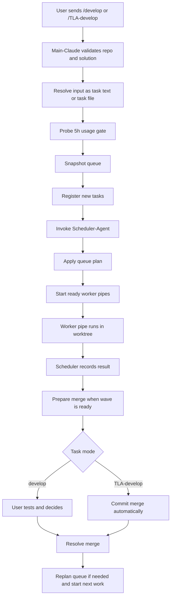
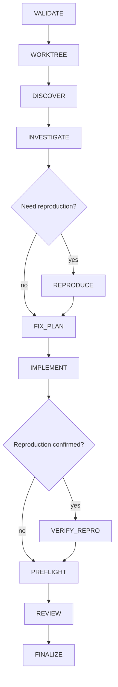
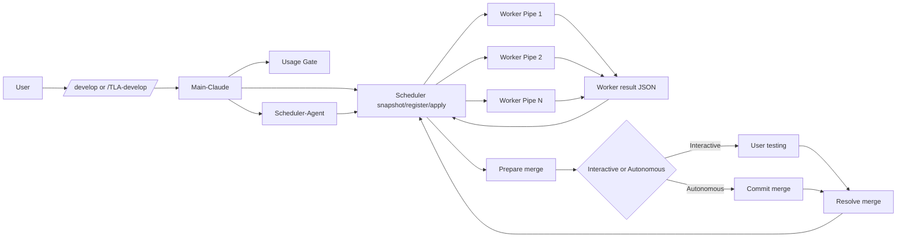

# AutoDevelop V4 Pipe Report

This document describes how the current AutoDevelop V4 system works end to end, from the user's command to the final merged result or terminal failure.

It covers:
- `/develop`
- `/TLA-develop`
- the Main-Claude orchestration flow
- the queue scheduler
- the Scheduler-Agent planning pass
- the worker pipe
- merge handling
- retries
- final task outcomes

## 1. High-Level Mental Model

AutoDevelop V4 is a layered system:

1. The user submits work with `/develop` or `/TLA-develop`.
2. Main-Claude does not implement code directly. It orchestrates.
3. Main-Claude registers tasks in a durable repo-local queue.
4. A read-only Scheduler-Agent plans safe execution waves.
5. The scheduler starts worker pipes in separate worktrees.
6. Each worker pipe runs the actual implementation pipeline.
7. Finished worker branches are merged back one by one.
8. Interactive tasks wait for user testing before merge commit.
9. Autonomous tasks merge automatically after successful preparation.

## 2. Main Components

### User Commands

- `/develop`
  - interactive mode
  - user testing is required before merge commit
- `/TLA-develop`
  - autonomous mode
  - successful prepared merges are committed automatically

### Main-Claude

Main-Claude is the top-level orchestrator defined by the skill files:
- [develop SKILL.md](D:/Repos/T.L-Marketplace/plugins/T.L-AutoDevelop/skills/develop/SKILL.md)
- [TLA-develop SKILL.md](D:/Repos/T.L-Marketplace/plugins/T.L-AutoDevelop-Pro/skills/TLA-develop/SKILL.md)

Main-Claude is responsible for:
- validating repo state
- finding the solution
- parsing task text or task files
- probing usage limits
- snapshotting the queue
- registering tasks
- invoking the Scheduler-Agent
- applying plans
- starting pipes
- driving merge resolution

### Scheduler

The durable queue engine is:
- [scheduler.ps1](D:/Repos/T.L-Marketplace/plugins/T.L-AutoDevelop/scripts/scheduler.ps1)

It is the source of truth for:
- task records
- wave assignments
- attempts used
- pending merges
- retry scheduling
- merge preparation and merge resolution

### Scheduler-Agent

The read-only wave planner is:
- [scheduler-agent.md](D:/Repos/T.L-Marketplace/plugins/T.L-AutoDevelop/agents/scheduler-agent.md)

It does not change code. It only:
- reads the queue snapshot
- reads relevant markdown docs
- predicts likely touched files/areas
- assigns tasks into conservative waves

### Worker Pipe

The actual implementation engine is:
- [auto-develop.ps1](D:/Repos/T.L-Marketplace/plugins/T.L-AutoDevelop/scripts/auto-develop.ps1)

It runs inside a dedicated git worktree and does the actual:
- discovery
- investigation
- reproduction
- planning
- implementation
- validation
- review

### Supporting Scripts

- usage gate:
  - [claude-usage-gate.ps1](D:/Repos/T.L-Marketplace/plugins/T.L-AutoDevelop/scripts/claude-usage-gate.ps1)
- deterministic validation:
  - [preflight.ps1](D:/Repos/T.L-Marketplace/plugins/T.L-AutoDevelop/scripts/preflight.ps1)
- code review agent:
  - [reviewer.md](D:/Repos/T.L-Marketplace/plugins/T.L-AutoDevelop/agents/reviewer.md)

## 3. End-to-End Flow



## 4. Command Entry

### 4.1 Supported Inputs

Both commands accept either:
- a direct task text
- a path to a file containing multiple tasks

If the argument points to an existing local file, Main-Claude switches into task-file mode.

Task-file parsing rules:
- bullet items are accepted
- numbered items are accepted
- plain non-empty lines are accepted
- headings and blank lines are ignored
- source order is preserved

### 4.2 Interactive vs Autonomous Registration

Each task is registered with a `sourceCommand`:
- `/develop` -> `develop`
- `/TLA-develop` -> `TLA-develop`

That field matters later during merge handling.

## 5. Initial Safety Checks

Before anything starts, Main-Claude checks:
- `git rev-parse --is-inside-work-tree`
- `git status --porcelain`

If the repository is dirty, the command stops.

Then Main-Claude resolves the active solution:
- searches for `*.sln` and `*.slnx`
- asks the user if more than one candidate exists

## 6. Usage Gate

Main-Claude calls:
- [claude-usage-gate.ps1](D:/Repos/T.L-Marketplace/plugins/T.L-AutoDevelop/scripts/claude-usage-gate.ps1)

The gate checks the 5-hour Claude usage state.

Policy:
- below 90% utilization -> continue
- at or above 90% -> ask for explicit overrun approval
- unavailable statusline/cache -> ask whether to ignore the limit
- fatal gate error -> stop

Important behavior:
- V4 does not silently wait for usage to drop
- the user explicitly approves or declines each scheduling cycle above the threshold

## 7. Queue State and Persistence

The scheduler stores durable state under:
- `.claude-develop-logs/scheduler/state.json`
- `.claude-develop-logs/scheduler/events.jsonl`

It also uses:
- a lock file for safe concurrent access
- task result files
- task run artifacts

Each queue task stores things like:
- `taskId`
- `taskText`
- `sourceCommand`
- `sourceInputType`
- `waveNumber`
- `submissionOrder`
- `state`
- `attemptsUsed`
- `attemptsRemaining`
- `retryScheduled`
- `waitingUserTest`
- `plannerMetadata`
- latest run info
- merge info

## 8. Scheduler Modes

The scheduler exposes these modes:
- `snapshot-queue`
- `register-tasks`
- `apply-plan`
- `run-task`
- `prepare-merge`
- `resolve-merge`

### 8.1 `snapshot-queue`

Returns:
- the full task list
- running task ids
- queued task ids
- retry task ids
- pending merge task ids
- `startableTaskIds`
- `nextMergeTaskId`
- `mergePreparedTaskId`
- unknown `auto/*` branches

### 8.2 `register-tasks`

Adds newly submitted tasks to the queue in submission order.

### 8.3 `apply-plan`

Applies the Scheduler-Agent's execution plan:
- wave numbers
- dependency blocking
- planner metadata

### 8.4 `run-task`

Starts one worker pipe for one task attempt.

### 8.5 `prepare-merge`

Attempts to merge a completed branch into the main repo using:
- `git merge --no-commit --no-ff <branch>`

Then validates with:
- `dotnet build <solution> --no-restore`

### 8.6 `resolve-merge`

Finalizes a prepared merge with one of:
- `commit`
- `abort`
- `discard`
- `requeue`

## 9. Scheduler-Agent Planning

The Scheduler-Agent receives:
- the full active queue snapshot
- newly added tasks
- currently running tasks
- pending merge tasks
- nearby docs like `CLAUDE.md`, `AGENTS.md`, `README.md`
- up to 3 additional nearby markdown files

Its job is to estimate:
- likely files
- likely modules
- conflict risk
- dependencies
- conservative wave assignments

It returns JSON only:

```json
{
  "summary": "Planning summary",
  "tasks": [
    {
      "taskId": "abc",
      "waveNumber": 1,
      "blockedBy": [],
      "plannerMetadata": {
        "likelyFiles": [],
        "likelyAreas": [],
        "dependencyHints": [],
        "conflictRisk": "LOW",
        "confidence": "MEDIUM",
        "rationale": "..."
      }
    }
  ],
  "startableTaskIds": ["abc"]
}
```

Planning rule:
- if independence is uncertain, serialize

## 10. Wave Execution Rules

The queue is wave-based.

Meaning:
- tasks in the same wave may start in parallel
- tasks in later waves wait
- merge handling gates progress

Important current rules:
- tasks only start from the earliest unresolved wave
- if a task in that wave is pending merge or already merge-prepared, no more tasks from that wave start
- retry-scheduled tasks are reset out of the active wave until they are replanned

This is intentionally conservative.

## 11. Worker Pipe Lifecycle

Each started task gets:
- a fresh attempt number
- a deterministic attempt task name
- a dedicated worktree branch such as `auto/<task>`
- a result file path

The scheduler then launches:
- [auto-develop.ps1](D:/Repos/T.L-Marketplace/plugins/T.L-AutoDevelop/scripts/auto-develop.ps1)

## 12. Worker Pipe Phases



### 12.1 Validate

The worker checks:
- the repo is a git repo
- the working tree is clean
- the solution exists

### 12.2 Worktree

The worker:
- creates a dedicated git worktree
- creates a dedicated branch
- executes all code changes there

### 12.3 Discover

This is a read-only routing phase.

It determines:
- task class
- likely target hints
- likely next phase
- whether the task is direct edit vs bugfix vs uncertain

### 12.4 Investigate

This is a deeper read-only analysis phase.

It decides:
- whether a code change is actually needed
- what files or areas are likely involved
- whether test-based reproduction is worth attempting

Possible outcomes:
- `CHANGE_NEEDED`
- `NO_CHANGE`
- `INCONCLUSIVE`

### 12.5 Reproduce

For likely bugfix/testable work, the worker may attempt to reproduce the issue with tests.

It tries to identify:
- test projects
- test files
- test names
- a reproducible failing filter

If reproduction succeeds:
- the worker stores a reproduction baseline
- later `VERIFY_REPRO` will ensure the fix actually resolves it

### 12.6 Fix Plan

The worker builds a concrete implementation plan with:
- goal
- files
- order

The plan is validated before implementation continues.

### 12.7 Implement

The worker makes code changes in the worktree.

Possible implementation categories include:
- `CHANGE_APPLIED`
- `NO_CHANGE_ALREADY_SATISFIED`
- `NO_CHANGE_TARGET_NOT_FOUND`
- `NO_CHANGE_BLOCKED`
- `NO_CHANGE_UNCERTAIN`

### 12.8 Verify Repro

If reproduction was confirmed earlier, the worker reruns the targeted tests.

If they still fail:
- the worker enters remediation loops
- it tries to repair only what is needed to satisfy the reproducing tests

### 12.9 Preflight

The worker runs deterministic validation via:
- [preflight.ps1](D:/Repos/T.L-Marketplace/plugins/T.L-AutoDevelop/scripts/preflight.ps1)

Preflight can check:
- build
- app startup, when configured
- test execution
- forbidden comments
- `NotImplementedException`
- multiple top-level types in one file
- NuGet policy
- XAML parse validity
- some warnings like file length or dispatcher usage

If preflight fails:
- the worker enters remediation loops

### 12.10 Review

The worker loads:
- [reviewer.md](D:/Repos/T.L-Marketplace/plugins/T.L-AutoDevelop/agents/reviewer.md)

The reviewer agent evaluates judgment-based quality that deterministic checks do not cover.

Possible review verdicts:
- `ACCEPTED`
- `DENIED_MINOR`
- `DENIED_MAJOR`
- `DENIED_RETHINK`

If review denies:
- the worker may attempt remediation
- minor issues can trigger a rescue pass
- repeated failure becomes terminal

## 13. Worker Outputs

At the end, the worker writes a machine-readable result JSON.

Common final statuses:
- `ACCEPTED`
- `FAILED`
- `NO_CHANGE`
- `ERROR`

The scheduler translates these into queue state transitions.

## 14. Queue State Transitions

Typical states are:
- `queued`
- `running`
- `pending_merge`
- `merge_prepared`
- `waiting_user_test`
- `retry_scheduled`
- `merged`
- `completed_no_change`
- `completed_failed_terminal`
- `discarded`

### Successful change

```text
queued -> running -> pending_merge -> merge_prepared/waiting_user_test -> merged
```

### No-change already satisfied

```text
queued -> running -> completed_no_change
```

### Retryable failure

```text
queued -> running -> retry_scheduled
```

### Exhausted failure

```text
queued -> running -> completed_failed_terminal
```

## 15. Retry Logic

Each task gets:
- `maxAttempts = 3`

A retry means:
- a full new worker attempt
- a fresh branch/worktree
- a new attempt number
- normal replanning through the queue

Retryable events include:
- pipeline failure
- missing pipeline result
- inconclusive work
- merge conflict
- merge preparation build failure
- review failure
- reproduction verification failure

Important V4 behavior:
- retries are not immediate shortcuts
- they re-enter queue planning

## 16. Merge Preparation

When a task is ready to merge, the scheduler checks:
- no other merge is already prepared
- the repo root is clean
- there are no unknown unmanaged `auto/*` branches
- actual changed files do not overlap with already merged earlier tasks

If actual overlap is detected:
- the task is requeued

If merge preparation succeeds:
- `/develop` tasks become `waiting_user_test`
- `/TLA-develop` tasks become `merge_prepared`

## 17. Interactive Merge Flow

For `/develop` tasks:

1. Scheduler prepares the merge.
2. Main-Claude tells the user to test.
3. User chooses one of:
   - `commit`
   - `abort`
   - `discard`
   - `requeue`

Meanings:
- `commit` -> create the merge commit and mark task merged
- `abort` -> stop this merge attempt and leave task pending
- `discard` -> drop the task permanently
- `requeue` -> turn it into retry-scheduled work if attempts remain

## 18. Autonomous Merge Flow

For `/TLA-develop` tasks:

1. Scheduler prepares the merge.
2. If preparation succeeds, Main-Claude commits immediately.
3. No user test checkpoint is required.

## 19. Merge Ordering

Merge order is deterministic:
- lower wave first
- earlier submission first within the wave

This keeps queue behavior stable and predictable.

## 20. Logging and Artifacts

The system writes logs and artifacts under `.claude-develop-logs/`.

Important outputs include:
- scheduler state
- scheduler events
- task snapshots
- worker run artifacts
- timeline logs
- pipeline history
- preflight outputs
- diffs
- review payloads

These artifacts make postmortem debugging possible.

## 21. Full System Diagram



## 22. What Is Actually New in V4

The main worker pipe is still the mature multi-stage pipe.

What V4 changes most strongly is the outer orchestration:
- unified single-task and task-file intake
- repo-local durable queue
- planner-driven wave execution
- async worktree pipes
- normal merge semantics instead of squash
- per-task interactive vs autonomous merge control

So V4 is best understood as:

`mature worker pipe` + `new queue scheduler` + `new planner agent` + `new merge orchestration`

## 23. Improvements Since V4.0.0

The `v4.0.0` baseline was the first queue-scheduler release.

Since that baseline, the system has been hardened substantially. The current documented behavior now reflects the accumulated changes through the `4.2.1` line.

### 23.1 Scheduler and Queue Hardening

Since `v4.0.0`, the scheduler gained:
- more forgiving but still conservative wave sizing
- stronger reconciliation and state repair behavior
- better retry and merge-state bookkeeping
- explicit queue-stall detection and one-cycle recovery support
- stronger run bookkeeping and state integrity warnings
- a dedicated prepare step via `/develop-prepare`

Operationally, this means the queue is now better at:
- detecting drift between persisted state and real repo state
- surfacing broken bookkeeping as warnings instead of failing silently
- recovering from blocked waves without requiring ad-hoc state edits

### 23.2 Merge and Environment Recovery

Post-`v4.0.0` releases also improved merge handling:
- TLA merge preparation can now detect lock-style build failures and kill common locker processes automatically
- environment retry recovery was hardened so broken worktrees and related environment faults are treated more explicitly
- blind repeated investigation retries are paused instead of looping indefinitely without new evidence

This reduced two recurring operational problems:
- autonomous merges blocked by local file locks
- retries that consumed budget without producing new information

### 23.3 Usage Gate and Launch Control

The launch policy is also materially stronger than the original `v4.0.0` scheduler release:
- TLA can wait automatically for the 5h usage gate instead of always requiring manual re-entry
- queued launch gating was tightened so projected wave cost is considered more carefully
- worker launch path quoting was fixed for spaced paths
- worker startup is now stricter about required prompt files and launcher selection
- worker launch identity is collision-safe instead of depending on a short truncated task token

This means current V4 is safer under:
- repos or temp paths containing spaces
- larger queues with similar-looking task ids
- mixed PowerShell environments
- autonomous runs that would otherwise stall at the usage gate

### 23.4 Planning, Progress, and Diagnostics

Planner and observability behavior also improved after `v4.0.0`:
- live progress output was restored and snapshot reporting became richer
- planner feedback matching was normalized so filename and directory predictions are scored more accurately
- current snapshots surface more explicit integrity warnings and queue diagnostics

That improved:
- user-facing visibility while tasks are running
- quality of later replanning decisions
- postmortem debugging when queue state or worker history drifts

### 23.5 Release Milestones After V4.0.0

Important post-baseline milestones visible in git history include:
- `4.1.0` hardening release
- `4.1.1` merge-conflict fix release
- subsequent queue, retry, progress, usage-gate, and launch fixes
- current `4.2.1` startup and worker launch hardening

In practical terms, the current system is not just the original queue scheduler release. It is the queue scheduler plus multiple rounds of:
- reconciliation hardening
- merge recovery
- usage-gate automation
- progress restoration
- planner feedback tuning
- worker launch correctness fixes

## 24. Short Operational Summary

If you want the shortest possible summary of the current system:

1. User submits one or more tasks.
2. Main-Claude validates the repo and checks usage budget.
3. Tasks are registered in a durable queue.
4. Scheduler-Agent assigns conservative waves.
5. Scheduler starts safe parallel worker pipes.
6. Each worker runs: discover, investigate, reproduce if needed, plan, implement, validate, review.
7. Successful branches wait for ordered merge.
8. `/develop` waits for user testing before commit.
9. `/TLA-develop` commits automatically after successful preparation.
10. Failures become retries until attempt budget is exhausted.

## 25. Changes Since This Report Was Last Updated

This report file was last updated on `2026-03-18 16:36`.

Since then, the AutoDevelop codebase continued to change materially. The current code now reflects the `4.2.5` line for `T.L-AutoDevelop`, not just the `4.2.1`-era behavior described above.

The most important changes since that report update fall into four groups:
- scheduler control-flow additions
- environment preparation and queue waiting support
- worker launch and state-bookkeeping hardening
- result publication and reconciliation hardening

The sections below describe those additions in practical rather than purely commit-history terms.

### 25.1 New Scheduler Modes Now in the Product

The current scheduler parameter validation includes two modes that are not documented in the earlier sections of this report:
- `wait-queue`
- `prepare-environment`

That means the mode list in section 8 is now incomplete.

#### `wait-queue`

The scheduler can now wait for queue-relevant state changes itself instead of relying on external shell sleeps or crude polling loops.

Operationally, this means Main-Claude can:
- launch the current ready workers
- hand control back to `scheduler.ps1`
- let the scheduler wake the orchestration flow when something important changed

The current wake model is explicitly parameterized through:
- `WakeOnAnyCompletion`
- `WakeOnMergeReady`
- `WakeOnBreakerOpen`
- timeout and idle-poll controls

This is a meaningful architectural improvement because queue waiting is now:
- scheduler-owned
- state-aware
- test-covered
- less dependent on ad hoc outer-shell timing

#### `prepare-environment`

There is now a dedicated environment preparation pass exposed through the scheduler and used by `/develop-prepare`.

This mode does more than a simple cleanup. It reconciles the live repo against persisted AutoDevelop state and selectively removes stale AutoDevelop-owned leftovers such as:
- stale worktrees
- stale `auto/*` branches
- stale run artifact directories

It also preserves still-live AutoDevelop activity where appropriate.

This matters because AutoDevelop startup is now stronger against:
- interrupted prior sessions
- stale run artifacts
- stale scheduler bookkeeping
- repo-local drift between git state and persisted queue state

### 25.2 Main-Claude Runtime Behavior Is More Scheduler-Driven

The earlier report already explained the durable queue model, but the current code and README now make two stronger runtime assumptions explicit:

- Main-Claude should hand waiting back to the scheduler after launches
- environment preparation is now an explicit first-class operation, not just a manual hygiene idea

In practical terms, AutoDevelop is now more "repo-local scheduler controlled" than the report body currently suggests.

The orchestration loop now leans more heavily on:
- repo-local persisted scheduler state
- scheduler wake reasons
- scheduler-managed preparation/cleanup

rather than on outer shell timing or operator intuition.

### 25.3 Startup and Worker Launch Hardening Added After the Report

Several worker-launch and startup hardening changes landed after this report update.

These changes are visible across the current code, skills, tests, and git history:
- stricter worker launcher resolution and startup handling
- stronger prompt-file validation
- more robust handling for spaced paths
- collision-safe worker identity / launch naming
- better run bookkeeping and state integrity checks

The practical outcome is that current AutoDevelop is safer than the report currently implies when running under:
- paths containing spaces
- mixed PowerShell environments
- repeated restarts
- queues containing many similar task ids

This is especially important because the worker process tree now relies on more scheduler-managed metadata:
- deterministic task names
- per-launch stdout/stderr paths
- per-launch result paths
- richer latest-run artifact pointers surfaced in task snapshots

### 25.4 Queue Waiting and Wake Semantics Are More Explicit

The older report explains queue planning and wave execution, but the current implementation now has explicit queue wake semantics.

The scheduler can now wake the outer orchestration when:
- a task completes
- merge work becomes ready
- the breaker opens
- a timeout occurs without meaningful change

That means the system no longer just "runs tasks and later checks again". It can:
- block while waiting
- re-evaluate state centrally
- wake deterministically for the next orchestration decision

This closes an earlier operational gap where queue progress depended too much on external polling cadence.

### 25.5 Environment Preparation and Cleanup Are More Selective

The current implementation is more careful about deciding what to delete versus preserve.

Examples now covered by tests and current scheduler behavior include:
- preserving alive retry launch artifacts
- cleaning stale retry launch artifacts
- preserving pending-merge branches while cleaning obsolete launch leftovers
- removing orphaned AutoDevelop run artifact directories only when they are truly stale

This is a substantial improvement over a simpler "clean leftovers on startup" model.

The actual behavior is now closer to:
- reconcile first
- classify ownership and liveness
- clean only what is stale and AutoDevelop-owned
- preserve anything that still belongs to an active or recoverable run

### 25.6 Result Publication and Reconciliation Are Now More Hardened

Since the report update, the worker/scheduler result handoff gained an additional round of hardening.

#### Atomic-ish worker result publication

`auto-develop.ps1` no longer writes the final result JSON directly to the final path in one step.

It now:
1. writes to a temp file in the same directory
2. replaces or moves into the final result path

This reduces the chance that the scheduler sees a partially written final result artifact.

#### Best-effort scheduler result reads

Critical scheduler result reads now use the best-effort JSON read helper instead of a single strict read in the important missing-result paths.

That improves resilience against:
- short-lived file-write timing windows
- transient malformed/incomplete reads during publication
- races between worker finalization and scheduler reconciliation

#### Late-result recovery for successful current-run artifacts

The scheduler can now recover an `environment_retry_scheduled` task if the current latest-run result artifact appears late and represents a successful recovery state.

This recovery is intentionally narrow. It only applies late results that represent:
- `ACCEPTED`
- or `NO_CHANGE_ALREADY_SATISFIED`

It does not replay late failure artifacts.

That distinction matters because the reconciler is now explicitly guarded against re-consuming environment-repair budget from the same failure artifact.

### 25.7 Environment Retry Semantics Are More Accurate

The current system tightened several details around environment retry handling that are not described in the older report text.

Those details now include:
- stale `lastEnvironmentFailureCategory` is cleared when a task genuinely recovers
- late successful or satisfied results can remove stale environment-failure residue
- environment-repair budgeting now respects the configured maximum exactly instead of allowing one implicit extra cycle
- repeated reconciliation of a failure artifact is now expected to be idempotent

This improves both correctness and observability:
- the UI/snapshot no longer has to keep showing an old environment failure after a successful recovery
- scheduler bookkeeping is less likely to drift under repeated recovery checks
- environment repair budget is more trustworthy

### 25.8 Snapshot and Diagnostics Surface More Runtime Truth

The current snapshots and task progress views carry richer artifact pointers and state context than the older report emphasizes.

Recent hardening and tests now explicitly validate snapshot visibility for:
- worker stdout path
- worker stderr path
- scheduler snapshot path
- timeline path
- run artifact directory

That matters in practice because the scheduler output is now more useful for:
- live troubleshooting
- postmortem analysis
- diagnosing whether a task really failed or merely looked stale temporarily

### 25.9 The Current System Version Boundary

The earlier report positions the documented system around the `4.2.1` line.

That is now outdated.

The current shipped plugin lines are:
- `T.L-AutoDevelop v4.2.17`
- `T.L-AutoDevelop-Pro v4.2.10`

The delta from the report body to the current implementation therefore includes:
- queue wait mode
- prepare-environment mode
- more selective cleanup/reconciliation
- additional launch and startup hardening
- stronger result publication and result read behavior
- tighter environment retry accounting
- late success/no-change recovery logic

### 25.10 Additional Changes Since The Documentation Commit `a543b6e`

`AUTODEV_PIPE_REPORT.md` was last updated in commit `a543b6e` on `2026-03-19`.

The implementation moved again after that point. The important additions since that documentation commit are:

#### Planning and implementation guardrails became stricter

The worker pipe now contains more explicit protection against "plausible but wrong" implementation plans.

Since `a543b6e`, the current system added:
- planner effort wiring and discovery briefs
- implementation-scope validation against the actual changed files
- repaired fix-plan direction checks
- prior-art grounding for reuse-heavy tasks

Practically, that means current AutoDevelop is more opinionated about:
- whether a plan is drifting
- whether a repaired plan may continue
- whether changed files still fit the approved implementation scope
- whether reuse-heavy tasks must cite concrete existing patterns before implementation continues

This is a meaningful maturity step because the pipe is no longer just validating code after implementation.
It is now also validating whether the implementation direction remains justified while the worker is still deciding what to do.

#### Retry memory and merge preparation were hardened further

The current branch strengthened two queue/runtime areas that the older report only partially reflects:
- retry context memory now preserves semantically relevant lessons more explicitly
- merge preparation now runs restore before build and reports restore-related failures more cleanly

That changes the practical pipe behavior in two useful ways:
- repeated retries are less likely to forget the real blocker
- merge preparation is less likely to fail for reasons that should have been caught by a restore pass first

#### Preflight is stricter about callback wiring evidence

Preflight gained a stronger Blazor/UI-specific validation pass for EventCallback introduction and binding evidence.

The current preflight behavior now warns when:
- a component introduces a callback
- existing parent usages are found
- none of those usages bind the new callback

This reduces one of the more annoying "pipe said green, UI still broken" classes of regression.

#### The usage gate now owns its own usage retrieval

The older report described a statusline/cache-based usage gate.

That is no longer the current design.

The current implementation now:
- reads Claude OAuth credentials directly
- calls the usage endpoint itself
- writes an AutoDevelop-owned cache file
- treats stale cache as informational only
- keeps autonomous blocked-state waiting only for confirmed usage data with a reset time

That is operationally important because the gate is no longer documented correctly if it is described as a statusline parser.
The current gate should be understood as an AutoDevelop-owned provider with stricter launch-safety semantics.

#### Test coverage expanded materially

The test suite gained large additional coverage around:
- planning guardrails
- prior-art requirements
- retry context memory
- merge preparation ordering
- usage-gate behavior and wait semantics
- stricter preflight wiring checks

That matters for interpretation of the current system because the branch is not only "more features".
It is also substantially more specified by regression tests than the older report text suggests.

## 26. What the Current System Should Now Be Understood As

If sections 22 to 24 gave the right mental model for the earlier `4.2.1`-era system, the current `4.2.17` / `4.2.10` system is best understood as:

`mature worker pipe`
`+ durable queue scheduler`
`+ scheduler-owned waiting`
`+ explicit prepare/hygiene reconciliation`
`+ stronger launch identity and startup validation`
`+ hardened result publication and reconciliation`
`+ planning-direction and implementation-scope guardrails`
`+ prior-art-aware task grounding`
`+ autodev-owned usage-gate safety`

That is a meaningful maturity increase.

The current product is not just:
- queue planning
- worker execution
- merge handling

It is also now explicitly about:
- recovery from interrupted sessions
- queue-state wake control
- reconciliation-safe cleanup
- resilient worker-result handoff
- avoiding stale environment-failure residue after recovery
- stopping drifted implementations before they broaden silently
- grounding reuse-heavy work in existing reference patterns
- refusing worker launches when the usage state cannot be verified safely

## 27. Current Short Operational Summary

If you want the updated shortest possible summary of the current system:

1. User submits one or more tasks through `/develop` or `/TLA-develop`.
2. Main-Claude can first run environment preparation to reconcile stale AutoDevelop-owned leftovers.
3. Main-Claude validates repo state, resolves the solution, and checks the usage gate.
4. Tasks are registered in a durable repo-local scheduler queue.
5. Scheduler-Agent assigns conservative waves.
6. Scheduler starts safe worker pipes and can then wait for queue-relevant changes itself.
7. Each worker runs the deterministic pipeline: discover, investigate, reproduce if needed, fix-plan, implement, preflight, review, finalize.
8. Worker results are now published more safely and read more defensively by the scheduler.
9. Successful branches wait for ordered merge preparation.
10. `/develop` waits for user testing before merge commit; `/TLA-develop` auto-commits after successful merge preparation.
11. Environment failures, retries, and interrupted-session leftovers are now reconciled more explicitly than in the earlier V4 releases.
