# T.L Marketplace for Claude Code Tools

A Claude Code plugin marketplace focused on .NET development automation.

## Included Plugins

### T.L-AutoDevelop (v4.2.5)

Interactive queue-aware development orchestration for .NET repositories.

Commands:
- `/develop [task text]`
- `/develop [path-to-task-file]`

Behavior:
- validates the repository and solution context
- keeps a shared repo-scoped queue of running, queued, retryable, and pending-merge tasks
- uses a read-only Scheduler-Agent to plan conservative execution waves
- starts multiple worker pipes asynchronously when waves are safely disjoint
- lets the scheduler wait for queue changes after launches instead of relying on external 2-minute shell polling
- prepares normal merges with `git merge --no-commit --no-ff`
- asks the user to test interactive tasks before the final merge commit

### T.L-AutoDevelop-Pro (v4.2.3)

Autonomous queue-aware orchestration built on top of T.L-AutoDevelop.

Commands:
- `/TLA-develop [task text]`
- `/TLA-develop [path-to-task-file]`

Behavior:
- uses the same shared scheduler queue and planner
- starts autonomous worker pipes
- lets the scheduler wait for queue changes after launches instead of relying on external 2-minute shell polling
- commits prepared merges automatically after validation succeeds
- still asks before a 5h usage overrun at scheduling time

## Pipeline Flow

Worker pipes still use the AutoDevelop engine flow:

```text
Discover -> Investigate -> optional Reproduce -> Fix Plan -> Implement -> Verify Repro -> Preflight -> Review
```

## Runtime Model

V4 is queue-centric:
- one shared queue per repository
- tasks may be submitted one at a time or from a task file through the same command
- retries are scheduled work, not immediate reruns
- merge preparation and merge resolution are explicit scheduler steps
- batch commands are removed in favor of unified `/develop` and `/TLA-develop`

## Documentation

- Pipeline report: `AUTODEV_PIPE_REPORT.md`
- Interactive workflow visualization: `ReadMe-Resources/autodevelop_v4.2.5_complete_pipe_workflow.html`

## Workflow Visualization

[](ReadMe-Resources/autodevelop_v4.2.5_complete_pipe_workflow.html)

Open the HTML version for the full interactive view.

## Requirements

- Windows (PowerShell 5.1+)
- .NET SDK
- Git with worktree support
- Claude CLI installed and authenticated

## Installation

Add this marketplace to Claude Code:

```text
/plugin marketplace add TLeiott/T.L-Marketplace4CCToolz
```

Then install the plugin you want:

```text
/plugin install T.L-AutoDevelop
```

```text
/plugin install T.L-AutoDevelop-Pro
```

## Versioning

Do not publish changed marketplace or plugin content under an unchanged version number.

If a distributed behavior or packaged file changes, bump the affected plugin version in:
- `.claude-plugin/marketplace.json`
- `plugins/<plugin>/.claude-plugin/plugin.json`

## Language

V4 prompts, skills, agents, manifests, and docs are intended to be English.

## License

MIT
